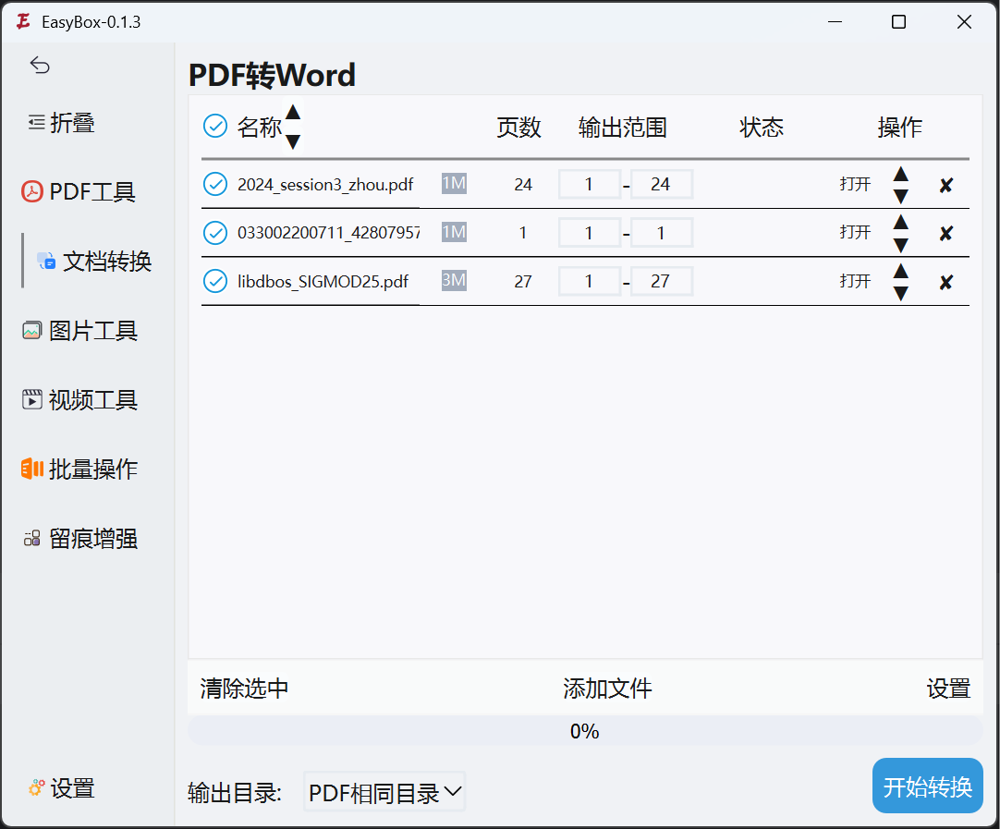

# EasyBox——一个多功能工具箱

## 支持的功能

* PDF工具箱
  * 合并PDF✅
  * 拆分PDF✅
  * PDF加密✅
  * PDF解密✅
* 文档转换
  * PDF转Word
  * 网页转PDF
* 图片工具
  * 根据文件名修改图片拍摄时间

## 相关文章

* [Python合并多个PDF](https://blog.lc044.love/post/11)
* [PyQt5/PySide6自定义可拖拽列表组件](https://blog.lc044.love/post/12)
* [基于文件名修改图片的拍摄日期](https://blog.lc044.love/post/14)
* [基于 PyQt5/PySide6 实现分组列表滚动吸顶效果](https://blog.lc044.love/post/15)

## 运行截图





## PDF工具箱功能说明

### PDF合并
将多个PDF文件合并为一个文件，支持设置文件顺序和页面范围，可以保留原PDF的书签。

### PDF拆分
支持多种拆分方式：按页数拆分、按页码范围拆分、提取单页、拆分为单页文件。输出文件格式为"原文件名_拆分文件_页码.pdf"。

### PDF加密
为PDF文件添加密码保护，支持设置用户密码(打开文档)和所有者密码(编辑文档)，可自定义权限控制(打印、复制、修改等)，支持多种加密方式(AES-128, RC4-128, RC4-40)。

### PDF解密
提供多种解密方式：
- 常规解密：使用用户提供的密码解密
- 密码破解：使用John the Ripper自动破解PDF密码(需额外安装)，支持字典攻击和暴力破解

## 计划中功能

* PDF工具箱
  * 添加水印
  * 去除水印
* 文档转换
  * PDF转Word
  * PDF转图片
  * PDF转TXT
  * PDF转MarkDown
  * 图片转PDF
* 批量工具
  * 批量重命名
  * 图片批量改格式
  * 文档批量加水印
  * 批量替换文本
* 视频工具
  * 屏幕录制（没有分辨率限制）
  * 定时录制
  * 视频转GIF
  * 视频转avi
  * 视频转MP4

## 安装

```shell
git clone https://github.com/LC044/EasyBox.git
cd EaseBox
pip install -r requirements.txt
```

## 运行

```shell
python main.py
```

## 打包

```shell
pip install pyinstaller
pyinstaller main1.spec
```

## 证书

[AGPL3.0](./LICENSE)